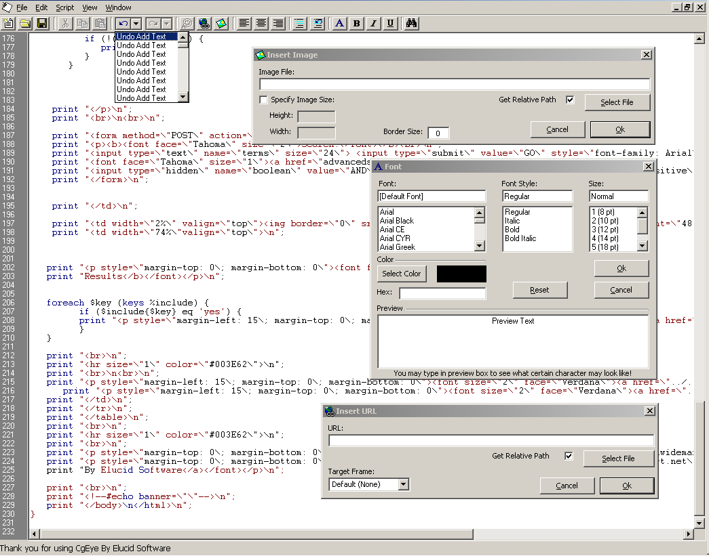



## CgEye \(Make CGI Scripts Easier THAN EVER\!\!\!\!\!\)

### Description

Lets you edit, look at, and much more with cgi scripts. Numbers the lines on the right, highlights the code and even as you type, uses ZER0 OCX's and much much more. Also shows you how to do a lot of stuff involving a text editor or script editor. Saves all your settings and uses intuitive non-ocx interfaces throughout. As well as using common dialog's with api, unlimited undo , complex string manipulation, and much more.

(Updated October 16: Fixed a GUI bug and redid the color module yet again...Still some bugs in it that are really annoying..Also fixed a bug with the undo/redo staying enabled when you closed a mdiform..Thanks to drevil for pointing that out to me.)
 
### More Info
 

             |
---                |---
**Submitted On**   |2000-10-16 20:44:22
**By**             |[Eric Malamisura](https://github.com/Planet-Source-Code/PSCIndex/blob/master/ByAuthor/eric-malamisura.md)
**Level**          |Advanced
**User Rating**    |4.9 (108 globes from 22 users)
**Compatibility**  |VB 5\.0, VB 6\.0
**Category**       |[Internet/ HTML](https://github.com/Planet-Source-Code/PSCIndex/blob/master/ByCategory/internet-html__1-34.md)
**World**          |[Visual Basic](https://github.com/Planet-Source-Code/PSCIndex/blob/master/ByWorld/visual-basic.md)
**Archive File**   |[CODE\_UPLOAD1070210162000\.zip](https://github.com/Planet-Source-Code/eric-malamisura-cgeye-make-cgi-scripts-easier-than-ever__1-11414/archive/master.zip)

